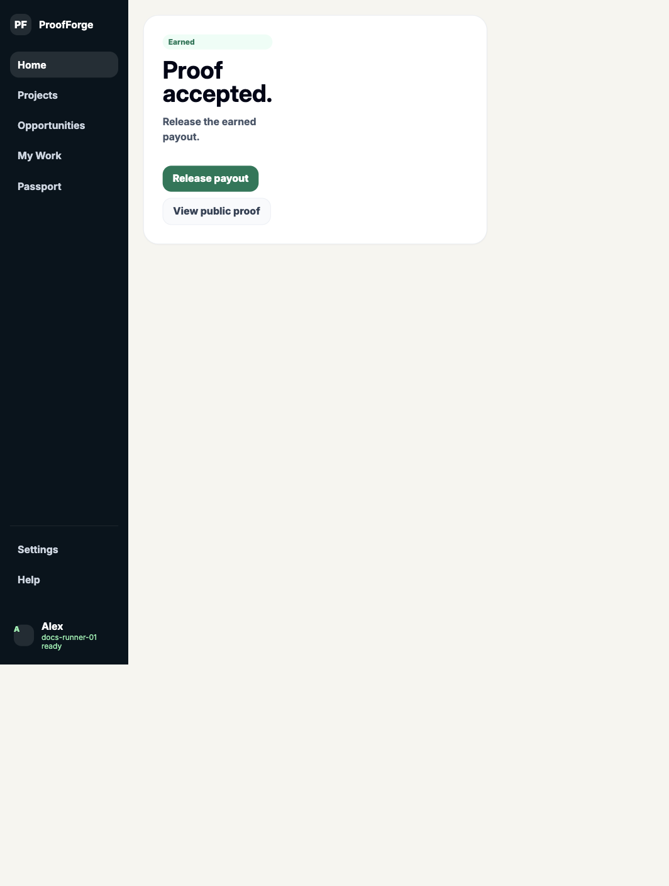
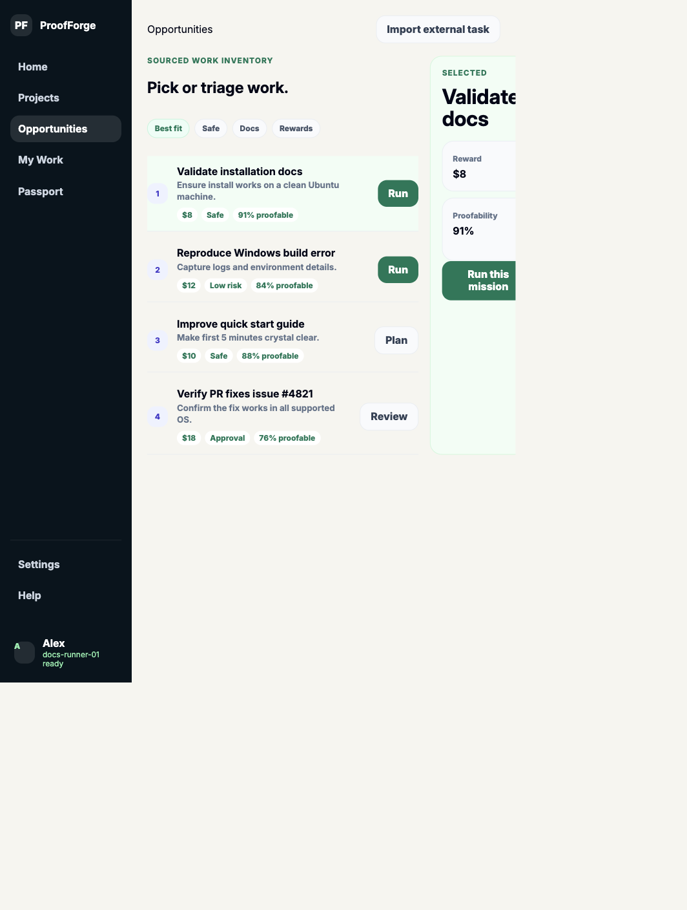
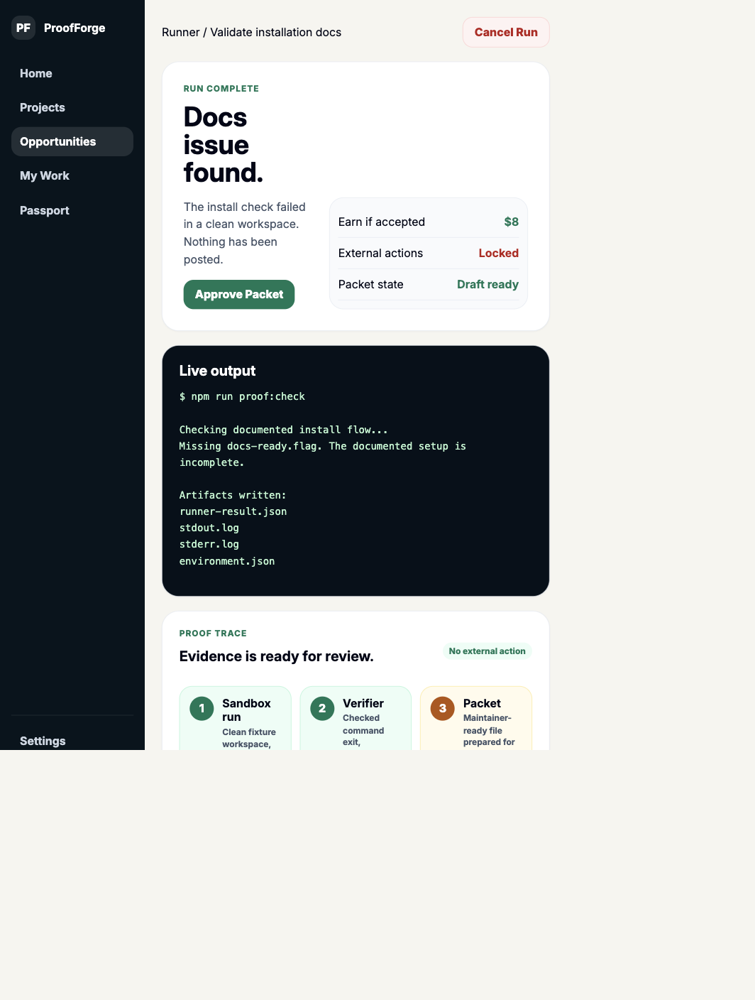
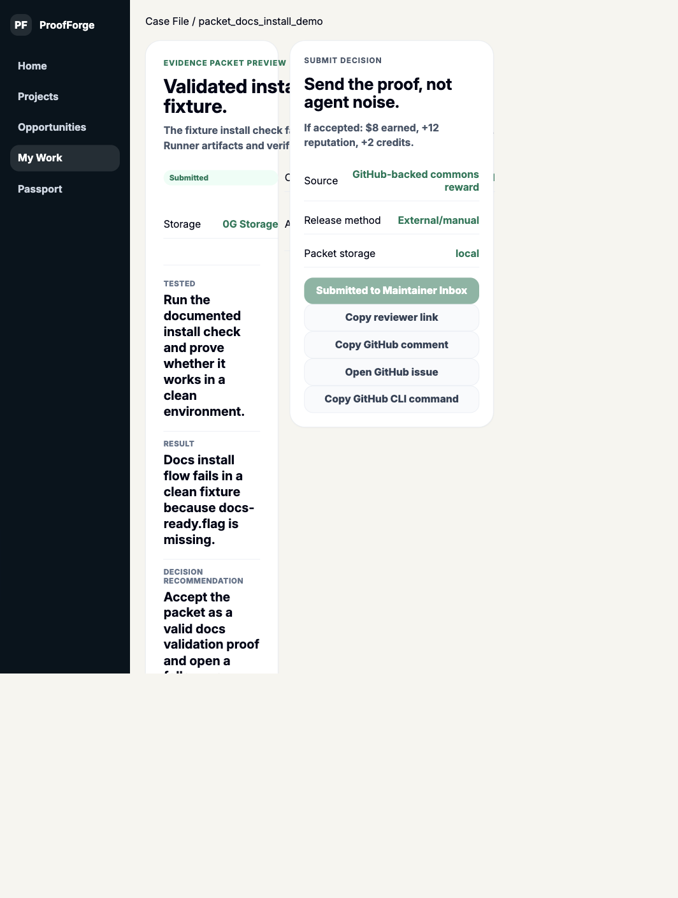
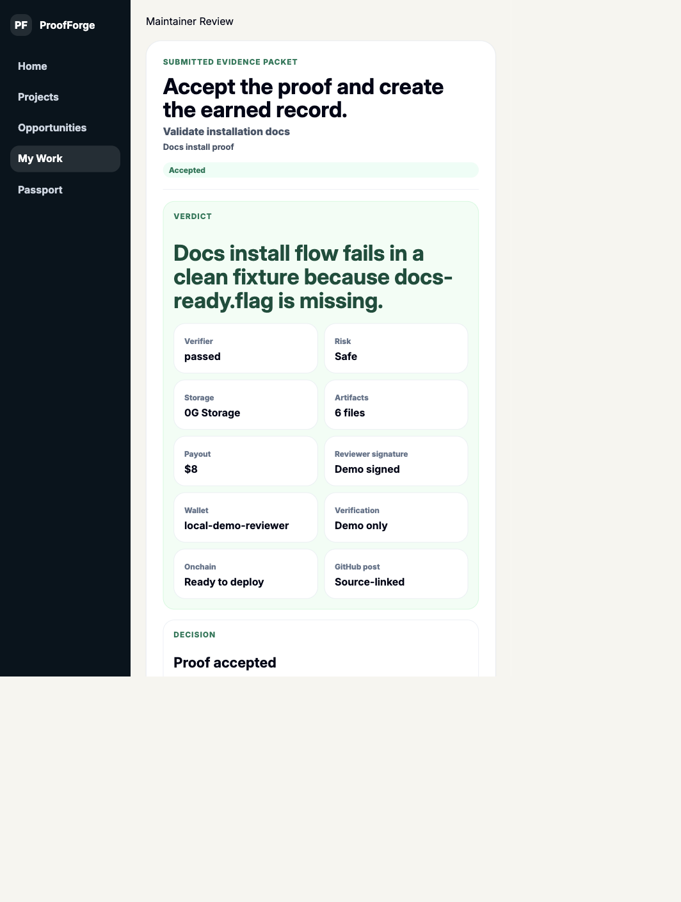
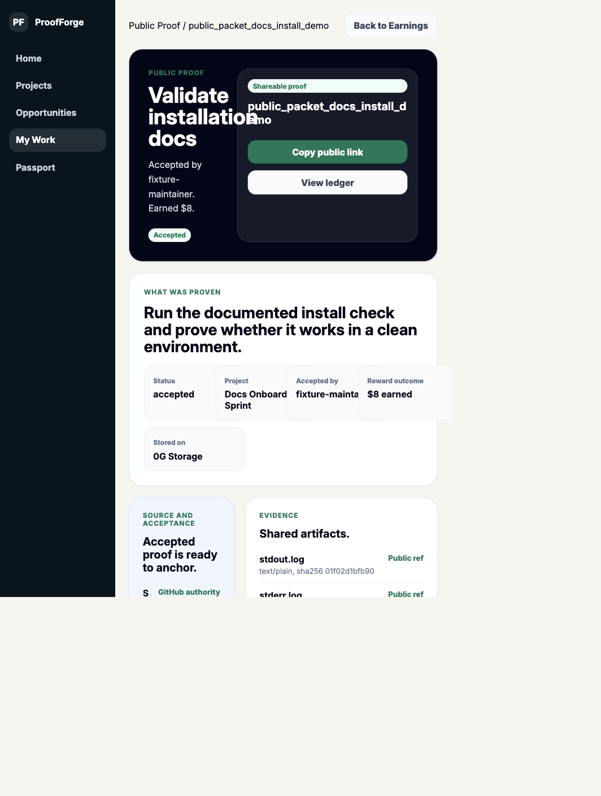
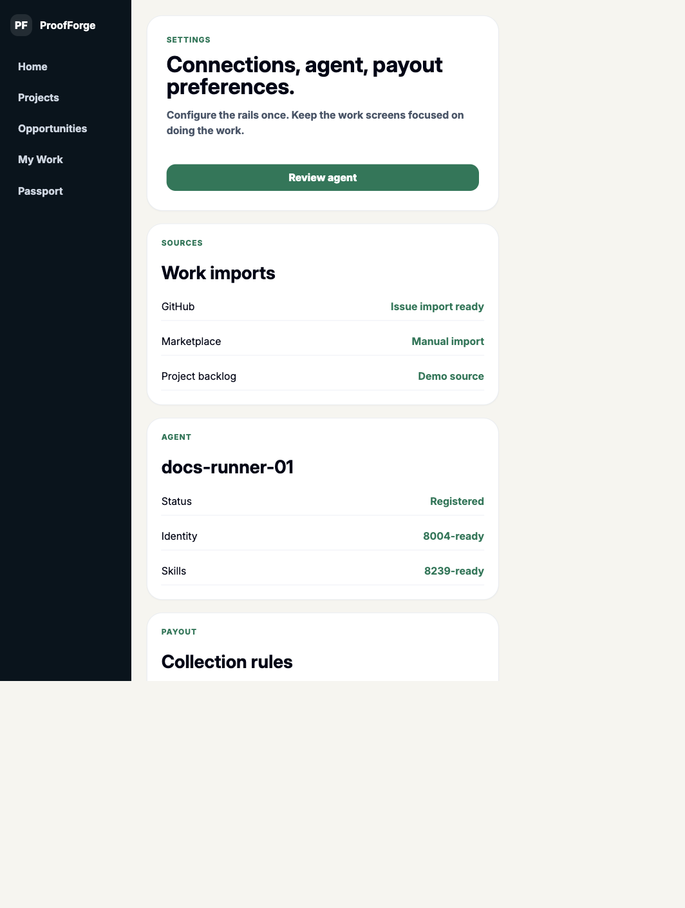

# ProofForge

ProofForge turns useful software work into accepted proof, so people and their
agents can be reviewed, credited, paid, and trusted.

Built for the **Open Agents Hackathon**.

- Live app: [https://proofforgehub.vercel.app](https://proofforgehub.vercel.app)
- Demo script: [docs/DEMO_SCRIPT.md](docs/DEMO_SCRIPT.md)
- Submission checklist:
  [docs/SUBMISSION_CHECKLIST.md](docs/SUBMISSION_CHECKLIST.md)

## Why We Built This

Agents make it easier to produce code, checks, research, and fixes. The problem
is that useful work still gets scattered across GitHub issues, unfinished
projects, bounties, hackathon teams, grant work, and chats.

Maintainers do not need more raw agent output. Contributors do not need another
place where work disappears without credit. Projects need a clear way to turn
source-backed work into accepted evidence, credit, and payout state.

ProofForge is the layer between messy work and recognized value.

```text
source-backed work
-> bounded mission
-> agent-assisted proof
-> evidence packet
-> maintainer review
-> accepted credit / payout state
-> public proof
```

ProofForge is **not** another marketplace. It is a proof and coordination layer
for people, agents, and projects to build useful things together and keep value
attached to the work.

## What Works Now

The current V1 is an operational hosted/local-first product flow:

- Register a bounded proof node with owner, skills, and blocked actions.
- Pick source-backed work from a project issue/backlog-style inventory.
- Convert work into a narrow mission with risk, value, and acceptance owner.
- Run a safe evidence-mode proof mission.
- Generate a maintainer-ready case file.
- Copy reviewer links and GitHub maintainer comments.
- Record the posted GitHub source URL back into ProofForge.
- Sign maintainer acceptance with MetaMask or the demo signer fallback.
- Mark proof as accepted and earned.
- Track credit, payout receipt state, and public-safe proof.
- Prepare a 0G evidence upload handoff and record returned 0G receipts.
- Prepare non-custodial payout handoff metadata.
- Publish/pull shared project state through the V1 GUN sync adapter.
- Optionally anchor accepted proof through the `ProofRegistry` contract if a
  browser wallet and network are ready.

## Product Screens

### Start / Agent Readiness



### Sourced Work Inventory



### Bounded Runner



### Evidence Packet / Case File



### Maintainer Review



### Public Proof



### Settings / Handoffs



## Demo Path

Start clean:

```text
Settings -> Reset demo state
```

Then run:

```text
Home / #opportunity
-> Set up proof node
-> Register proof node
-> Find source-backed work
-> Run this mission
-> Accept and run
-> Approve Packet
-> Submit Packet
-> Connect MetaMask or demo signer
-> paste GitHub acceptance URL
-> Record GitHub post
-> Sign acceptance
-> Accept & Mark Earned
-> View public proof
-> Settings handoffs
```

Sample GitHub acceptance URL for the demo:

```text
https://github.com/Devpen787/proofforge/issues/1#issuecomment-proof
```

## Sponsor And Prize Relevance

### 0G

ProofForge uses 0G as the durable evidence-record path.

The hosted app does not put private 0G keys in the browser. Instead, Settings
exports the proof network record and prepares the runner command:

```bash
npm run 0g:upload-record -- --in <proof-network-record.json>
```

When the runner returns a `0g://...` receipt or root, the reviewer records it in
ProofForge so it appears in Public Proof and exported records.

This makes 0G meaningful in the product: it is the durable storage rail for
evidence packets and proof network records, not fake user work.

### Agent Tooling

ProofForge is agent infrastructure for contribution proof:

- bounded proof node identity
- allowed and blocked actions
- source-backed mission terms
- evidence-mode execution
- verifier result
- maintainer-ready packet
- human acceptance before credit or payout state

The agent is useful because it helps produce evidence safely. It does not post,
spend, or claim value by itself.

### Ethereum / Wallet / Onchain

ProofForge supports wallet-signed acceptance and includes a minimal EVM
`ProofRegistry` contract for optional accepted-proof anchoring.

The contract stores proof references and hashes. The private evidence stays in
the proof packet / 0G record path.

### GitHub / Open Source

GitHub remains the source authority. ProofForge prepares maintainer comments and
opens the source issue, but maintainers post from their own GitHub account. The
posted URL is then recorded back into ProofForge and shown in Public Proof.

This avoids storing GitHub credentials while still proving the source and review
handoff.

### Payout Rails

V1 tracks earned payout and external receipt state. It can prepare Safe, Splits,
and Drips handoff metadata, but it does not custody funds or automatically move
money.

## Proofs And Verification

Run the full local gate:

```bash
npm install
npm run format:check
npm run lint
npm run typecheck
npm test
npm run build
npm run smoke:web
```

Run the production smoke:

```bash
npm run smoke:web:prod
```

Generate deterministic proof artifacts:

```bash
npm run demo:packet
npm run sync:web-proof
```

Generated proof files:

```text
demo-output/docs-install/packet/evidence-packet.json
demo-output/docs-install/packet/case-file.md
demo-output/docs-install/packet/policy.json
demo-output/docs-install/packet/public-packet.json
demo-output/docs-install/packet/payout.json
demo-output/docs-install/packet/project.json
demo-output/docs-install/packet/submission-evidence.json
demo-output/docs-install/packet/submission-evidence.md
```

Import a public GitHub issue as a Work Lead:

```bash
npm run import:github -- --url https://github.com/microsoft/vscode/issues/1
```

Convert a mission-ready Work Lead:

```bash
npm run convert:lead -- --in demo-output/imports/example.work-lead.json
```

Check 0G configuration:

```bash
npm run 0g:check
```

Upload a proof network record to 0G when credentials are configured:

```bash
npm run 0g:upload-record -- --in <proof-network-record.json>
```

## Run Locally

```bash
npm install
npm run dev -w apps/web -- --port 5175 --strictPort
```

Open:

```text
http://localhost:5175/#opportunity
```

Useful routes:

```text
Start: http://localhost:5175/#opportunity
Agent Setup: http://localhost:5175/#agent-setup
Projects: http://localhost:5175/#projects
Opportunities: http://localhost:5175/#work-queue
Mission Detail: http://localhost:5175/#mission-detail
Runner: http://localhost:5175/#run
Case File: http://localhost:5175/#case-file
Maintainer Review: http://localhost:5175/#maintainer
My Work: http://localhost:5175/#my-work
Builder Passport: http://localhost:5175/#builder-passport
Public Proof: http://localhost:5175/#public-proof
Settings: http://localhost:5175/#settings
```

## What To Claim Honestly

Working today:

- hosted app
- local-first proof workflow
- source-backed missions
- bounded proof-node run
- evidence packet generation
- maintainer review flow
- GitHub handoff and recorded source URL
- wallet/demo-signed acceptance
- credit and payout receipt tracking
- public proof
- 0G upload handoff and receipt recording
- optional onchain ProofRegistry anchoring

Not claiming yet:

- automatic payout settlement
- automatic PR creation
- automatic GitHub posting through OAuth
- hosted multi-user backend
- private 0G key in browser
- live ENS, AXL, KeeperHub, Uniswap, or Gensyn integrations unless separately
  implemented and verified

## Future

The larger vision is a contribution layer for the agent economy:

- project owners publish useful work as missions
- contributors and agents safely help
- proof packets make the work reviewable
- maintainers accept, reject, or request revisions
- accepted proof updates credit, reputation, payout, access, or ownership-like
  benefits
- projects gain an auditable history of who helped and what held up

The next production milestones are:

1. GitHub App / OAuth install for verified repo ownership and optional live
   writeback.
2. Hardened multi-user project permissions.
3. One-click 0G upload through a safe server/runner boundary.
4. Optional attestation layer for accepted proof.
5. Settlement integrations that remain non-custodial and human-approved.

## AI Tooling Transparency

AI tools were used as development assistants for planning, coding, refactoring,
documentation, and verification. The project includes the source code,
documentation, proof artifacts, and version history needed to inspect what was
built and how it works.

## License

MIT
