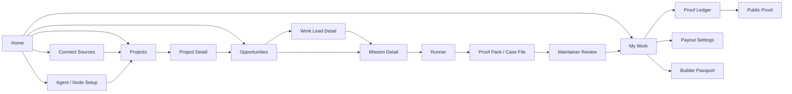

# ProofForge Product Storyboard

Use this before changing screens. It is the product mock in text form: the fastest way to align the experience before coding.

This document does not replace the operating guide, journeys, lifecycle map, value model, or source qualification rules. It turns them into a screen-by-screen product target.

## Product Shape

ProofForge is a connected contribution graph and proof layer over existing work networks.

It should feel like:

```text
Connect work sources
-> see useful project opportunities
-> let a registered agent/node produce evidence
-> submit a Proof Pack
-> get human acceptance
-> track credit, benefits, payout, and public proof
```

It should not feel like:

```text
Dashboard full of internal objects
Agent chat room
Generic bounty board
Second GitHub
Crypto payout app before proof exists
```

## The Atomic Unit

The product revolves around the `Proof Pack`.

```text
Proof Pack =
source-backed work
+ mission terms
+ agent/node run
+ verifier result
+ human approval
+ maintainer-safe case file
+ credit/value state
```

Every main screen must either help the user create, review, accept, track, or share a Proof Pack.

## Primary Navigation

Keep primary navigation small and user-intent based.

```text
Home
Projects
Opportunities
My Work
```

Contextual screens appear only when needed:

```text
Connect Sources
Agent Setup
Work Lead Detail
Mission Detail
Runner
Case File / Proof Pack
Maintainer Review
Proof Ledger
Public Proof
Payout Settings
Builder Passport
```

Do not put every object in the sidebar. `Proof Packets` should not be a permanent tab for a new user. Before proof exists, it is empty. After proof exists, it belongs under `My Work`, `Project Ledger`, or `Public Proof`.

## Global UX Rules

- One screen, one job, one obvious next click.
- Cards are objects or decisions, not essays.
- Copy should tell the user what state they are in, not repeat the whole product thesis.
- Do not show the proof loop banner on every page.
- Do not explain payout on every screen. Show payout terms where the user chooses work, submits proof, accepts proof, or collects.
- Do not show raw agent chatter by default. Show proof-relevant trace.
- Do not imply wallet settlement, NFT ownership, automatic payment, or revenue share unless project terms explicitly define it.
- Every work item must show source, project, acceptance owner, proof needed, and value path before it becomes runnable.
- Every earned value state must distinguish credit, benefit, earned payout, released payout, and ownership.
- Ethereum/Web3 belongs where it affects identity, bounty source, receipt, release, public proof, or project funding. Do not scatter wallet and tx details across unrelated screens.

## Experience Compression Rules

The product should feel simple because every screen compresses complexity into the next useful decision.

| Screen         | Compression rule                                          |
| -------------- | --------------------------------------------------------- |
| Home           | Next action, not dashboard.                               |
| Projects       | Project buckets and proof economy, not admin workspace.   |
| Opportunities  | Qualified work discovery, not a triage textbook.          |
| Mission Detail | Accept terms before run.                                  |
| Runner         | Live proof generation, not agent chat.                    |
| Proof Pack     | Maintainer-ready artifact, not log viewer.                |
| My Work        | Contribution/value tracker, not second project dashboard. |
| Public Proof   | Shareable accepted proof, not private case file.          |

Layout rules:

- Above the fold: current state, one useful object, one primary action.
- Maximum one hero or lead panel per screen.
- Maximum one primary CTA per screen state.
- Maximum three secondary actions in the main view.
- Maximum three major sections above the fold.
- Put education, protocol details, raw logs, scoring, and policy matrices behind details, tabs, or later screens.
- If a card needs a title, an explanation, a process, and a reason to care, it is probably doing too much.

## Product Map



## Role Swimlane Contract

ProofForge has one product journey, but several role journeys inside it. The UI should make the active role obvious without forcing the user to think about internal architecture.

| Role                      | Owns                                                                   | Should see first                                              | Should not be forced to manage                             |
| ------------------------- | ---------------------------------------------------------------------- | ------------------------------------------------------------- | ---------------------------------------------------------- |
| Contributor / Agent Owner | source connections, agent setup, mission acceptance, packet submission | next useful opportunity, agent readiness, value if accepted   | steward-only project settings, raw protocol details        |
| Project Steward           | project purpose, source links, value rules, benefits, opportunities    | project health, open work, active work, proof ledger summary  | runner internals, unrelated personal work                  |
| Agent / Node System       | sandboxed execution, evidence capture, verifier trace, packaging       | policy, command, artifacts, verifier status                   | payout decisions, ownership terms, public posting          |
| Maintainer / Reviewer     | accept, revise, or reject proof                                        | clean case file, what was proven, risk, privacy, value impact | agent chat, raw logs by default, project admin             |
| Value Layer               | credit, earned payout, release state, public proof                     | accepted proof, recipient, value type, release method         | unaccepted work as final credit, unsupported custody       |
| Public Viewer             | trust accepted proof safely                                            | what was proven, who accepted it, public-safe artifacts       | private logs, local paths, payout settings, internal notes |

Role handoff:

```text
Steward defines project/source/value rules
-> Contributor accepts mission terms
-> Agent system produces evidence
-> Maintainer accepts or rejects proof
-> Value layer records credit/payout/benefit
-> Contributor and project ledgers update
```

If a screen blurs role ownership, simplify it.

## Decision Gate Contract

The gates are the product. They prevent ProofForge from becoming a noisy bounty board or unsafe agent launcher.

| Gate                     | Required to pass                                             | If it fails                                    |
| ------------------------ | ------------------------------------------------------------ | ---------------------------------------------- |
| Source gate              | source type, source URL/reference, project or owner context  | keep as unassigned Work Lead                   |
| Project gate             | project bucket or explicit unassigned state                  | ask user to create/attach project              |
| Acceptance gate          | maintainer, steward, buyer, or reviewer who can accept proof | block mission conversion                       |
| Proofability gate        | clear objective and evidence shape                           | ask clarification or reject                    |
| Value gate               | payout, credit, benefit, reputation-only, or no-value state  | do not advertise earnings                      |
| Agent readiness gate     | agent/node identity, owner, safe policy, verifier path       | route to setup or block run                    |
| Run safety gate          | sandbox, blocked external actions, no secrets, no spend      | block or require explicit approval             |
| Packet quality gate      | evidence exists, verifier result, privacy/security review    | save draft, redact, retry, or block submission |
| Maintainer decision gate | accept, revise, or reject                                    | only accepted proof creates final credit/value |
| Value creation gate      | accepted proof plus defined value rules                      | create credit always; payout only if defined   |
| Release gate             | earned payout plus release method/receipt                    | keep as earned, not released                   |
| Public proof gate        | accepted proof plus redaction/privacy pass                   | keep private until safe                        |

Hard rules:

- Work Lead cannot become Mission without project, source, acceptance owner, proof requirement, risk, allowed/blocked actions, and value path.
- Mission cannot run without a safe agent/node path.
- Proof Pack cannot submit without privacy/security review.
- Accepted proof always creates a credit record.
- Accepted proof creates earned payout only when payout is defined.
- Released payout is always separate from earned payout.
- Public Proof is unavailable before acceptance and redaction.

## Outcome Surface Rules

Some product areas are outcome surfaces, not primary journey steps.

| Surface          | Purpose                                                  | Appears when                                      | Primary question                                   |
| ---------------- | -------------------------------------------------------- | ------------------------------------------------- | -------------------------------------------------- |
| Proof Ledger     | private/user/project accepted-proof record               | proof is accepted or project has proof history    | What was accepted and what value state exists?     |
| Public Proof     | redacted shareable proof artifact                        | proof is accepted and public-safe                 | What can others trust without seeing private data? |
| Payout Settings  | value collection configuration                           | user has or expects earned payout/external payout | How do I collect or track release?                 |
| Builder Passport | cross-source contribution history                        | user has connected sources or accepted proof      | What have I contributed across projects?           |
| Wallet / Receipt | payout recipient and external/onchain receipt references | user has a value path or released payout          | Where is value collected or evidenced?             |

These should not become first-run clutter. They should appear as outcomes from Home, My Work, Project Detail, and Proof Ledger.

## Product Layer Model

Design and implementation should organize the product around three layers.

```text
Project / source layer
-> Proof layer
-> Value layer
```

| Layer                  | User question                                 | Product responsibility                                           |
| ---------------------- | --------------------------------------------- | ---------------------------------------------------------------- |
| Project / source layer | Where did this work come from and why matter? | connect/import source, attach to project, qualify work           |
| Proof layer            | Can my agent safely prove it?                 | define mission terms, run safely, verify evidence, package proof |
| Value layer            | What happens if accepted?                     | record credit, benefit, earned payout, release, public proof     |

The UI should not expose these as three abstract layers. It should make them felt through concrete decisions:

```text
Choose useful project work
-> accept mission terms
-> review proof
-> track accepted value
```

## Circular Flywheel Model

The experience should loop, not end.

```text
Connect sources and identities
-> observe existing contributions
-> track projects
-> find useful open work
-> prove work with human or agent help
-> maintainer accepts proof
-> update credit, payout, benefit, public proof
-> project and builder graphs improve
-> recommend better work
```

This means Home, Projects, My Work, Proof Ledger, and Builder Passport are connected surfaces:

| Surface          | Flywheel responsibility                                       |
| ---------------- | ------------------------------------------------------------- |
| Home             | choose the next best action from history and active states    |
| Projects         | show project buckets, project growth, and user's relationship |
| My Work          | track observed, active, submitted, accepted, earned states    |
| Proof Ledger     | audit accepted proof and value records                        |
| Builder Passport | show portable accepted contribution across sources            |

The product should support multiple entryways:

```text
Connect GitHub
Paste source URL
Join project
Create project
Register agent
Connect wallet
Import marketplace task
Track existing contribution
```

All entryways normalize into:

```text
Project / Source
-> Work Lead or Observed Contribution
-> Mission or Proof Pack
-> Accepted Proof
-> Credit / Value / Public Record
```

GitHub is the first strong connector because it can show both past contribution and new work. Wallet/onchain records become stronger when linked to accepted proof or external payout receipts.

## Ethereum / Web3 / Bounty Surface Rules

The product should make Web3 useful without making the product feel like a crypto dashboard.

### Where Web3 Appears

```text
Connect Sources
-> payout recipient / wallet state
-> bounty, DAO proposal, grant, or treasury source URL

Mission Detail
-> sponsor/funder
-> reward amount and asset
-> release method
-> custody status
-> recipient

Proof Pack / Case File
-> value if accepted
-> receipt refs if present
-> what can be shared publicly

My Work / Proof Ledger
-> credit
-> earned payout
-> released payout
-> tx hash, receipt URL, or external platform reference

Public Proof
-> public-safe wallet/project/receipt reference only after acceptance
```

### Where Web3 Does Not Appear By Default

```text
Runner
Home hero
every opportunity card
every project metric
every navigation item
raw technical protocol panels
```

### Bounty Card Pattern

For a bounty-like opportunity, show only the decision facts:

```text
Title
Project / source
Accepted by
Value if accepted
Method: external / wallet / credits / reputation
Custody: ProofForge does not hold funds
[Review mission]
```

Do not show a long explanation of Ethereum, bounties, ownership, credit, and payout on the card. Those belong in mission terms, payout settings, or proof ledger details.

### Receipt Pattern

Once value is released externally:

```text
Released payout
Method: wallet / external platform / manual
Receipt: 0x... or external URL
Matched to: accepted Proof Pack
Public: yes/no
```

Never present a transaction as proof unless it is linked to accepted proof.

## Adjacent Product Boundary

There are tempting adjacent ideas: pooled unused AI credits, topic markets, agent companies, dividends, and prediction markets. They can be future expansion paths, but they should not define the MVP screens.

Adopt now:

```text
GitHub contribution import
wallet/onchain signal tracking
project growth dashboard
personal contribution graph
agent identity and owner rollup
explicit project value rules
```

Park:

```text
credit pooling
topic markets
dividends
full agent company workspace
autonomous settlement
```

The storyboard should optimize for:

```text
source-backed project work
-> safe proof
-> human acceptance
-> visible credit/value/project history
```

## Defensible MVP Contract

The hackathon prototype should prove one narrow but real-feeling path.

```text
I import or connect real work.
My agent safely runs it.
Proof is packaged.
A maintainer accepts it.
I can see credit and earned payout state.
The accepted proof appears in my work and project ledger.
```

Minimum credible integration path:

| Area         | MVP expectation                                       | Must not claim                                      |
| ------------ | ----------------------------------------------------- | --------------------------------------------------- |
| Work source  | GitHub issue import or paste URL creates Work Lead    | broad live marketplace/DAO coverage                 |
| Agent/node   | local proof node identity and local runner/verifier   | autonomous agent company or external agent network  |
| Proof        | generated Evidence Packet and maintainer Case File    | production-grade legal attestation                  |
| Acceptance   | maintainer review simulation with strict state guards | automatic GitHub posting or PR submission           |
| Value        | local credit and earned/released payout records       | custody, instant settlement, guaranteed payment     |
| Public proof | redacted accepted proof view                          | public proof before acceptance or privacy clearance |

If a feature does not support this path, keep it secondary until the path works.

## Core Data Contracts

These are the minimum contracts the UI must be able to explain.

### Source Record

Every Work Lead needs:

```text
sourceType
sourceUrl or sourceReference
sourceOwner
projectName / projectHandle
repository or external system
rawRequest
acceptanceOwner
rewardPath or valuePath
proofability
risk
missingInfo
recommendation
```

If `source`, `project`, or `acceptanceOwner` is missing, the UI must not call the item mission-ready.

### Project Value Rules

Every project should define or explicitly omit:

```text
acceptedProofCriteria
acceptanceOwner
creditRules
benefitRules
payoutRules
releaseMethod
custodyStatus
ownershipTerms
ruleChangePolicy
```

Default MVP terms:

```text
creditRules: accepted proof creates contribution credit
benefitRules: local unlocks only
payoutRules: manual or external tracking
custodyStatus: ProofForge does not control funds
ownershipTerms: none defined
```

### Agent / Node Identity

Every run should show:

```text
agentId
owner
creditRecipient
payoutRecipient
projectAttachments
specialties
allowedActions
blockedActions
limits
verifierRole
packagerRole
health
```

Default MVP:

```text
Agent and node work rolls up to owner.
Agent does not receive payout directly.
Verifier is distinct from runner, even if locally simulated.
```

### Proof Pack

Every Proof Pack should contain:

```text
source record
mission terms
agent identity
runner output
verifier result
privacy review
security review
artifact list
shared/private split
maintainer decision
credit/value state
```

### Value Record

Every accepted proof should produce:

```text
creditRecord
benefitRecord if defined
earnedPayout if payout defined
releasedPayout only after release action
publicProof only after redaction/privacy pass
ownershipRecord only if explicitly defined
```

## Unresolved Case Handling

These cases are not edge decorations. They affect trust.

| Case                                  | Product behavior                                                         |
| ------------------------------------- | ------------------------------------------------------------------------ |
| Maintainer never responds             | Keep packet submitted/pending; show follow-up path and stale age.        |
| Project changes value rules after run | Existing mission keeps terms accepted at run start.                      |
| Project pool runs out                 | New missions cannot advertise payout; existing earned records remain.    |
| External payout cannot be verified    | Track as external pending; do not mark released without receipt/action.  |
| Wallet disconnected                   | Credit and manual/external payout tracking still work.                   |
| Source deleted or link breaks         | Keep local proof/source snapshot and mark source unavailable.            |
| Agent run disputed                    | Attach dispute to Proof Pack; do not delete evidence history.            |
| Secret found after submission         | Mark public proof unavailable; require redaction/revision.               |
| Ownership requested                   | Show `none defined` unless project has explicit terms.                   |
| Spam or low-quality imported work     | Keep as rejected/parked Work Lead; never promote automatically.          |
| Duplicate accepted packet             | Guard blocks duplicate credit/payout creation.                           |
| Contributor and agent owner differ    | Use project value rules; otherwise credit recipient is mission assignee. |

## Current Redesign Targets

The current UI should be judged against these targets.

| Surface        | Rework toward                                      | Remove or hide                                    |
| -------------- | -------------------------------------------------- | ------------------------------------------------- |
| Home           | launch surface with one best action                | repeated proof loop, many explanatory panels      |
| Projects       | project buckets with sources, opportunities, proof | admin clutter and unrelated metrics               |
| Opportunities  | clean qualified work list                          | large triage textbook cards in default view       |
| Mission Detail | compact mission contract                           | payout education and product explanation overload |
| Runner         | proof operation cockpit                            | agent chat, broad system diagrams                 |
| Proof Pack     | evidence dossier                                   | raw logs by default, generic dashboard layout     |
| Maintainer     | fast decision support                              | thin cards with unexplained buttons               |
| My Work        | personal contribution/value tracker                | project dashboard duplication                     |
| Ledger         | accepted-proof accounting                          | public/private mixing                             |

## 1. Home

### Job

Help a new or returning user answer: "What should I do next?"

### Primary user

Contributor / agent owner.

### What the user sees

- Short product promise.
- Connection state: GitHub, wallet, local proof node, project memberships.
- One recommended next action.
- Three compact state rows:
  - active work
  - earned or pending value
  - accepted proof / credit
- A short list of best matched opportunities.

### Sketch

```text
Home

[Hero: Find useful project work. Prove it. Track accepted credit.]
[Primary CTA: Start safest proof] [Secondary: Connect sources]

[Connection strip]
GitHub: connected/modelled | Wallet: not connected | Node: docs-runner-01 | Project: Docs Onboarding Sprint

[Next action]
Validate installation docs
Source: GitHub/docs fixture
Accepted by: Commons reviewer
Value: $8 earned if accepted + 12 reputation + 2 credits
[Review mission]

[My state]
Active work: 1 running
Pending review: 1 packet
Earned payout: $8, not released

[Matched opportunities]
title | project | accepted by | value | risk | action
```

### Primary action

`Review mission` or `Set up proof node` if no node exists.

### State changes

- No mutation unless user starts setup or chooses a mission.
- Returning users route to the highest priority active state.

### Hidden / secondary

- Full proof loop.
- Full payout explainer.
- Raw policy matrix.
- Agent internals.

### Edge cases

| Case                 | Behavior                                         |
| -------------------- | ------------------------------------------------ |
| No agent/node        | Primary CTA becomes `Set up proof node`.         |
| No connected sources | Show demo opportunity and `Connect GitHub`.      |
| Has revision request | Primary CTA becomes `Fix revision`.              |
| Has earned payout    | Secondary card shows `Release / mark paid`.      |
| No value path        | Opportunity says `credit only` or `needs value`. |

### Done gate

A new user can identify the first click in under 5 seconds.

## 2. Connect Sources

### Job

Let the user connect or model the places where work, identity, payout, and contribution history come from.

### Primary user

Contributor, agent owner, or project steward.

### What the user sees

- GitHub connection/import state.
- Wallet or payout recipient state.
- Bounty, DAO proposal, grant, marketplace, or foundation URL imports as source/value references.
- Project source links.
- Clear distinction between live, modelled, and future integrations.

### Sketch

```text
Connect Sources

Bring existing work into ProofForge.

[GitHub]
Status: demo import ready
Imports: issues, repos, labels, source URLs
[Import GitHub issue]

[Wallet / payout recipient]
Status: not connected
Used for: payout recipient, receipt matching, proof badge/account link later
[Set payout method]

[Bounty / DAO / grant source]
Paste a source URL. ProofForge tracks source, sponsor, value path, and acceptance owner.
[Add source]

[Project sources]
Docs Onboarding Sprint
GitHub repo: connected/modelled
Docs URL: connected/modelled
Project pool: local demo
[Open project]

[Other sources]
Marketplace tasks: modelled
Foundation backlogs: modelled
DAO treasury: planned
```

### Primary action

`Import GitHub issue` or `Open project`, depending on entry state.

### State changes

- Imports or models Work Leads from source records.
- Attaches source records to projects.
- Updates connected identity/value state.

### Hidden / secondary

- OAuth internals.
- Raw API tokens.
- Full import logs.
- Unsupported source setup.

### Edge cases

| Case                 | Behavior                                                 |
| -------------------- | -------------------------------------------------------- |
| No GitHub connection | Offer demo import or paste URL.                          |
| Wallet not connected | Allow manual/credit-only tracking; label payout unready. |
| Source lacks project | Create unassigned Work Lead and ask user to attach.      |
| Source lacks value   | Do not advertise payout; mark credit/reputation only.    |
| Integration modelled | Label as modelled/demo, not live.                        |

### Done gate

The user knows where work comes from, which parts are connected, and which parts are only modelled.

## 3. Agent / Node Setup

### Job

Make clear who or what is doing the work, who owns it, what it can do, and how resulting credit rolls up.

### Primary user

Contributor / agent owner.

### What the user sees

- Agent/node identity.
- Owner and payout/credit recipient.
- Allowed actions.
- Blocked actions.
- Project attachments.
- Health and local runner readiness.
- Specialties or preferred mission types.
- Daily budget/usage limit state.
- Verifier/packager coordination role.

### Sketch

```text
Agent Setup

Register your proof node
Owner: Alex
Agent ID: docs-runner-01
Credit recipient: Alex
Payout recipient: not connected
Specialty: docs validation, Linux install checks
Limit: local demo, no spend permission

[Capability profile]
Allowed: clone public repos, run commands, capture logs, package evidence
Blocked: open PRs, post comments, access secrets, spend funds, submit externally

[Attach to project]
Docs Onboarding Sprint [attached]

[Coordination]
Runner: docs-runner-01
Verifier: verifier-01
Packager: local packager
All work rolls up to Alex unless project rules define a split.

[Primary CTA: Confirm node]
```

### Primary action

`Confirm node`.

### State changes

- Creates or confirms local agent identity.
- Stores allowed/blocked policy.
- Enables mission runs.

### Hidden / secondary

- Multi-agent frameworks.
- Credit pooling.
- Raw API keys.
- Agent-to-agent protocol details.

### Edge cases

| Case              | Behavior                                                      |
| ----------------- | ------------------------------------------------------------- |
| Node unhealthy    | Show repair action, block run.                                |
| No payout method  | Allow credit/reputation; label payout unready.                |
| Unsafe permission | Require explicit confirmation or block profile.               |
| No verifier       | Allow local run only if verification is modelled or selected. |

### Done gate

The user knows: agent ID, owner, what is allowed, what is blocked, and who receives credit.

## 4. Projects

### Job

Show the user's project buckets: where work, agents, proof, benefits, and value are organized.

### Primary user

Contributor and project steward.

### What the user sees

- Project list.
- For each project: purpose, source links, open opportunities, active work, accepted proof, value pool, benefits.
- One clean action per project.

### Sketch

```text
Projects

[Project card]
Docs Onboarding Sprint
Purpose: Make first-time install smoother.
Sources: GitHub repo, docs URL, project pool
Open: 4 opportunities | Active: 2 | Accepted: 12 | Pool: $240
Benefits: contributor badge, reviewer eligibility
Next: Validate installation docs
[Open project]

[Project card]
CLI Reliability
Open: 2 | Active: 1 | Accepted: 4 | Value: reputation-only
[Open project]

[Create or connect project]
```

### Primary action

`Open project`.

### State changes

- None unless user creates/connects project.

### Hidden / secondary

- Full proof ledger.
- Detailed payout settings.
- Every agent permission.

### Edge cases

| Case                | Behavior                                       |
| ------------------- | ---------------------------------------------- |
| No projects         | CTA: `Connect GitHub` or `Create project`.     |
| Project has no work | CTA: `Import source` or `Suggest opportunity`. |
| Project no value    | Label `credit/reputation only`.                |
| User only follows   | Show tracked project without steward controls. |

### Done gate

The user understands what projects they are part of and which one needs action.

## 5. Project Detail

### Job

Make a project feel like a living contribution economy without overwhelming the user.

### Primary user

Project steward, returning contributor.

### What the user sees

- Purpose and connected sources.
- Open opportunities.
- Active work.
- People and agents.
- Proof ledger summary.
- Benefits/unlocks.
- Value rules snapshot.
- Steward controls if user has permission.

### Sketch

```text
Docs Onboarding Sprint
Purpose: Make first-time install smoother.
Sources: GitHub, docs, project pool

[Primary actions]
Run best opportunity | Suggest work | Attach agent

[Open opportunities]
Validate installation docs     $8 + credit     Safe     [Run]
Reproduce Windows build error  $12             Low      [Run]
Improve quick start guide      benefit-only    Safe     [Plan]

[Active work]
Ready | Running | Needs review | Accepted

[People and agents]
Top contributors | Active proof nodes

[Benefits]
1 accepted proof: contributor badge
3 accepted proofs: reviewer eligibility
5 accepted proofs: early access

[Proof ledger summary]
Accepted: 12 | Pending: 3 | Earned: $240 | Latest: packet_docs_install_demo
[View ledger]

[Steward tools - permission gated]
Invite | Import source | Edit value rules
```

### Primary action

For contributor: `Run` on the best opportunity.

For steward: `Suggest work` or `Import source`.

### State changes

- Starting work routes to Mission Detail.
- Suggest/import creates Work Lead.
- Attach agent updates project agent list.
- Editing value rules updates future mission terms only.

### Hidden / secondary

- Deep source qualification.
- Payout export.
- Public project page controls.
- Agent internals.

### Edge cases

| Case                    | Behavior                                                |
| ----------------------- | ------------------------------------------------------- |
| Work missing owner      | Keep under Work Leads, not Open Opportunities.          |
| No attached agent       | Show `Attach agent` before run.                         |
| Benefit terms undefined | Show `No project benefits defined`, do not invent them. |
| Project pool empty      | Show credit/reputation opportunities only.              |
| User lacks permission   | Hide steward controls, keep contributor actions.        |

### Done gate

The user can see what the project needs, who is helping, what proof was accepted, and what value/benefits exist.

## 6. Create / Connect Project

### Job

Let a steward create a project bucket with sources, value rules, and proof criteria before inviting people or agents.

### Primary user

Project steward.

### What the user sees

- Project purpose.
- Source links.
- Opportunity lanes.
- Acceptance owner.
- Value rules.
- Benefit rules.
- Default agent policy.

### Sketch

```text
Create Project

Project: Docs Onboarding Sprint
Purpose: Make first-time install smoother.

[Sources]
GitHub repo | Docs URL | Project pool

[Accepted proof criteria]
Install validation, bug reproduction, PR verification
Acceptance owner: Commons reviewer

[Value rules]
Cash pool: $240 local demo
Credit: +12 reputation per accepted proof
Benefits: 1 proof badge, 3 proofs reviewer eligibility
Ownership: none defined

[Default agent policy]
Allowed: clone public repos, run commands, capture logs
Blocked: PRs, comments, secrets, spend funds

[Create project]
```

### Primary action

`Create project`.

### State changes

- Creates project.
- Adds founder/steward.
- Creates source placeholders and value rules.
- Routes to Project Detail.

### Hidden / secondary

- Treasury mechanics.
- Public project page design.
- Advanced role management.

### Edge cases

| Case                      | Behavior                                        |
| ------------------------- | ----------------------------------------------- |
| No source                 | Allow draft project, but no mission-ready work. |
| No acceptance owner       | Block mission conversion.                       |
| No value rules            | Default to credit/reputation only.              |
| Ownership terms requested | Require explicit project agreement.             |

### Done gate

A project can explain what it improves, where work comes from, who accepts proof, and what value accepted proof creates.

## 7. Opportunities

### Job

Help users find runnable, source-backed work and separate raw work from missions.

### Primary user

Contributor / agent owner.

### What the user sees

- Filters by project, source, value type, risk, proofability.
- Mission-ready opportunities first.
- Work Leads needing clarification separately.
- Source and acceptance owner visible on each row.
- Clear value type: cash, external, credit, benefit, or unknown.

### Sketch

```text
Opportunities

[Filters]
Project | Source | Risk | Value | Agent fit

[Mission-ready]
Validate installation docs
Project: Docs Onboarding Sprint
Source: GitHub/docs fixture
Accepted by: Commons reviewer
Value: $8 + reputation + credits
Risk: Safe | Runtime: 30 min
[Review]

[Needs triage]
External QA task imported
Missing: exact browser versions
Acceptance owner: external buyer
[Open lead]
```

### Primary action

`Review` for mission-ready work.

`Open lead` for incomplete work.

### State changes

- Reviewing a mission routes to Mission Detail.
- Opening incomplete work routes to Work Lead Detail.

### Hidden / secondary

- Full import CLI commands.
- Detailed scoring math.
- Raw source text unless user opens detail.

### Edge cases

| Case                     | Behavior                                       |
| ------------------------ | ---------------------------------------------- |
| Missing project/source   | Keep in Work Lead section, not runnable.       |
| Missing acceptance owner | Block conversion.                              |
| Unknown value path       | Label `credit only` or `needs value path`.     |
| Unsafe external action   | Mark evidence-only or blocked.                 |
| User has no agent        | Keep review available; route run CTA to setup. |

### Done gate

The user never has to guess whether an item is runnable or still raw.

## 8. Work Lead Detail

### Job

Turn messy source work into a qualified mission or explain why it is not ready.

### Primary user

Project steward or contributor importing work.

### What the user sees

- Raw source summary.
- Source owner/project.
- Proofability diagnosis.
- Missing information.
- Acceptance owner.
- Value path.
- Recommended next question.
- Convert gate.

### Sketch

```text
Work Lead Detail

External QA task imported
Source: Marketplace task
Project: Checkout Reliability
Acceptance owner: External buyer
Reward path: $25 external payout

[Qualification]
Objective: proof checkout works in Chrome and Safari
Proof needed: browser logs + screenshots
Risk: Medium
Missing: exact browser versions
Can convert: No

Next clarification:
Which Chrome and Safari versions should be tested?

[Ask clarification] [Reject] [Convert when ready - disabled]
```

### Primary action

`Ask clarification` until required fields exist.

### State changes

- Clarification updates missing fields.
- Conversion creates Mission.
- Rejection closes Work Lead.

### Hidden / secondary

- Full source import transcript.
- All scoring internals.

### Edge cases

| Case                   | Behavior                           |
| ---------------------- | ---------------------------------- |
| User forces conversion | Allow only if product marks risk.  |
| No value path          | Convert only as credit/reputation. |
| Private repo           | Require access policy before run.  |
| No acceptance owner    | Conversion blocked.                |

### Done gate

No raw work can become a mission without project, source, acceptance owner, proof, risk, and value path.

## 9. Mission Detail

### Job

Help the user decide if the mission is safe and worth running.

### Primary user

Contributor / agent owner.

### What the user sees

- What must be proven.
- Source/project.
- Who accepts proof.
- What value is created if accepted.
- What agent will do.
- What agent cannot do.
- Required artifacts.
- Collection or payout method state.
- Whether ProofForge controls funds.
- Whether ownership or benefits are defined.

### Sketch

```text
Mission Detail

Validate installation docs
Project: Docs Onboarding Sprint
Source: GitHub/docs fixture

What must be proven:
Run documented install in clean Ubuntu fixture and capture result.

Accepted by: Commons reviewer
Value if accepted: $8 earned payout + 12 reputation + 2 credits
Collection: manual payout not connected
Funds controlled by ProofForge: no, local demo accounting
Ownership: none defined
Benefit: contributor badge after first accepted proof

Agent:
docs-runner-01
Allowed: clone repo, run install command, capture logs
Blocked: PRs, comments, secrets, spend funds

Required proof:
evidence-packet.json | case-file.md | runner-result.json | stdout.log

[Run in sandbox] [Save]
```

### Primary action

`Run in sandbox`.

### State changes

- Creates a running mission state.
- Routes to Runner.

### Hidden / secondary

- Full opportunity marketplace.
- Full payout education.
- Public proof preview.

### Edge cases

| Case                     | Behavior                                        |
| ------------------------ | ----------------------------------------------- |
| No agent                 | CTA becomes `Set up proof node`.                |
| Mission blocked          | Show exact policy reason and alternatives.      |
| Value collection absent  | Still allow run, but show `not connected`.      |
| ProofForge not custodian | Say payout is tracked, not moved.               |
| Ownership requested      | Show terms missing unless project defines them. |

### Done gate

The user can explain what is being done, why, for whom, what it can earn, and what is blocked.

## 10. Runner

### Job

Show safe execution and proof generation, not a chatbot.

### Primary user

Contributor / agent owner.

### What the user sees

- Current mission.
- Execution timeline.
- Live output preview.
- Agent identity.
- Verifier status.
- Security state.
- Packet output preview.
- Cost/spend state when applicable.

### Sketch

```text
Runner

Validate installation docs
No external action has been taken.

[Timeline]
Sandbox created -> Repo loaded -> Dependencies installed -> Command running -> Logs captured -> Verifier checking -> Packet ready

[Live output]
npm run docs:build
...

[Security]
Sandbox: required | Write: blocked | Secrets: none | Network: restricted | External: locked

[Spend]
Funds: no spend permission
Credits: local demo, no API key shown

[Packet outputs]
evidence-packet.json
case-file.md
policy.json
public-packet.json

[Review Proof Pack] [Cancel]
```

### Primary action

`Review Proof Pack` after packet generation.

### State changes

- Running -> packet_ready.
- Creates Evidence Packet and Case File.

### Hidden / secondary

- Agent debate.
- Unfiltered logs unless opened.
- External submission buttons.

### Edge cases

| Case              | Behavior                                        |
| ----------------- | ----------------------------------------------- |
| Command fails     | Still package evidence if useful; mark failure. |
| Verifier fails    | Packet cannot submit until resolved or noted.   |
| Secret detected   | Require redaction in Case File.                 |
| User cancels      | Save local run state, no submission.            |
| Run exceeds limit | Pause and require approval before continuing.   |

### Done gate

The user trusts that no external action happened and knows what artifact was produced.

## 11. Proof Pack / Case File

### Job

Present the core artifact for human review.

### Primary user

Contributor before submission, maintainer after submission.

### What the user sees

- Maintainer summary.
- What was tested.
- Result and confidence.
- Evidence artifacts.
- Privacy review.
- Security review.
- Verifier checks.
- Shared vs private split.
- Value if accepted.
- Release/collection state if relevant.

### Sketch

```text
Proof Pack PF-2025-05-17-0012
Status: maintainer-ready

[Maintainer summary]
Tested: install flow on Ubuntu 24.04
Result: success / failure confirmed
Confidence: 91%
Recommendation: accept as docs validation proof

[Artifacts]
evidence-packet.json
case-file.md
policy.json
environment.json
stdout.log

[Reviews]
Privacy: passed, no secrets, paths masked
Security: evidence-only, no external actions
Verifier: all checks passed

[Submit decision]
If accepted: $8 earned + 12 reputation + 2 credits
Collection: manual payout not connected
Shared: summary, evidence packet, policy, verifier result
Private: raw local paths, private logs, payout settings

[Submit to Maintainer] [Save draft] [Download JSON]
```

### Primary action

`Submit to Maintainer`.

### State changes

- Packet draft/generated -> submitted.
- Creates maintainer inbox item.

### Hidden / secondary

- Full raw logs behind artifact links.
- Full protocol chain collapsed.
- Public proof until accepted.

### Edge cases

| Case                  | Behavior                                     |
| --------------------- | -------------------------------------------- |
| Privacy issue         | Disable submit until redacted or accepted.   |
| No acceptance owner   | Cannot submit; route back to lead/mission.   |
| Duplicate submit      | Route to existing submitted packet.          |
| Payout method missing | Submit allowed, collection shows incomplete. |
| External payout       | Mark as tracked outside ProofForge.          |

### Done gate

The Case File feels like the product asset, not just another status page.

## 12. Maintainer Review

### Job

Help the maintainer decide quickly without reading agent noise.

### Primary user

Maintainer / reviewer.

### What the user sees

- Decision queue.
- One selected packet summary.
- What was proven.
- Risk/privacy/security.
- Artifacts count.
- Payout/credit impact if accepted.
- Revision/rejection reasons.
- Recipient and value rule summary.

### Sketch

```text
Maintainer Review

[Queue]
Unresolved 3 | Accepted 8 | Revision 1 | Rejected 1

[Decision card]
Validate installation docs
What was proven: install flow completed in clean Ubuntu fixture
Confidence: 91%
Risk: Low
Privacy: Passed
Artifacts: 6
If accepted: $8 earned payout + 12 reputation + 2 credits
Recipient: Alex
Release: manual, separate from acceptance

[Review packet] [Accept & Mark Earned] [Request Revision] [Reject]
```

### Primary action

`Accept & Mark Earned`.

### State changes

- Submitted -> accepted/revision/rejected.
- Accepted creates credit record.
- Accepted creates earned payout record if value path includes payout.
- No automatic release.

### Hidden / secondary

- Full contributor profile.
- Full payout release tools unless accepted.
- Agent internals.

### Edge cases

| Case              | Behavior                                           |
| ----------------- | -------------------------------------------------- |
| Accept duplicate  | Guard blocks second payout/credit creation.        |
| Needs revision    | Structured reason required.                        |
| Reject            | Reason required; payout cancelled/not made.        |
| External payout   | Mark earned as external tracking record.           |
| Recipient unclear | Block acceptance until value recipient is defined. |

### Done gate

Maintainer can decide in under a minute from clean proof.

## 13. My Work

### Job

Give the user one place to track all open work, proof, credit, benefits, and payout across sources.

### Primary user

Contributor / agent owner.

### What the user sees

- Active work grouped by state.
- Accepted proof.
- Earned and released value.
- Connected source history.
- Agent/node contributions rolled up to owner.
- Next action per item.
- Project/source buckets.

### Sketch

```text
My Work

[Summary]
Active: 2 | Pending review: 1 | Accepted: 12 | Earned: $63 | Released: $12 | Reputation: 164

[Needs action]
Fix revision: Mac setup check
Release/mark paid: Validate installation docs

[Active work]
Running: Reproduce CLI crash
Submitted: Validate installation docs

[Accepted proof]
packet_docs_install_demo
Project: Docs Onboarding Sprint
Credit: +12 rep, +2 credits
Payout: $8 earned, not released
[View proof]

[Sources]
GitHub: connected/modelled
Wallet: not connected
Marketplace: planned

[Project buckets]
Docs Onboarding Sprint: 12 accepted, $63 earned, badge unlocked
CLI Reliability: 4 accepted, reputation-only
```

### Primary action

Whatever the highest-priority item needs: `Continue`, `Fix revision`, `Release`, or `View proof`.

### State changes

- Release payout -> released.
- View proof -> public/private proof view.
- Continue -> contextual route.

### Hidden / secondary

- Full project dashboards.
- Full import configuration.
- All raw logs.

### Edge cases

| Case                 | Behavior                                   |
| -------------------- | ------------------------------------------ |
| No work yet          | CTA to Opportunities.                      |
| Accepted unpaid work | Show credit/benefit even without payout.   |
| External payout      | Track status and receipt manually.         |
| Wallet not connected | Show payout method as incomplete.          |
| Work not accepted    | Track history, but do not count as credit. |

### Done gate

The user can answer: what did I contribute, what did my agent do, what was accepted, and what value changed?

## 14. Proof Ledger

### Job

Show private/user/project contribution accounting across accepted Proof Packs.

### Primary user

Contributor, project steward, sponsor.

### What the user sees

- Accepted Proof Packs.
- Project/source bucket.
- Contributor and agent owner.
- Credit, benefits, earned payout, released payout.
- Ownership terms if explicitly defined.
- Links to public-safe proof.

### Sketch

```text
Proof Ledger

PF-2025-05-17-0012
Project: Docs Onboarding Sprint
Source: GitHub/docs fixture
Contributor: Alex
Agent: docs-runner-01
Accepted by: Commons reviewer

Credit: +12 reputation, +2 credits
Benefit: contributor badge
Earned payout: $8
Released payout: not released
Ownership: none defined

[View public proof] [Open payout record]
```

### Primary action

`View public proof` or `Open payout record`.

### State changes

- None unless user releases payout or creates public proof.

### Hidden / secondary

- Raw artifacts.
- Private logs.
- Full project management.

### Edge cases

| Case                  | Behavior                                |
| --------------------- | --------------------------------------- |
| Accepted but unpaid   | Show earned payout, not released.       |
| Credit only           | Show no payout record.                  |
| Benefit only          | Show benefit and unlock terms.          |
| Ownership undefined   | Show `none defined`, not a vague claim. |
| Public proof disabled | Keep ledger private and explain why.    |

### Done gate

The user can audit what was accepted and what value state it created.

## 15. Public Proof

### Job

Show a redacted shareable artifact for one accepted Proof Pack.

### Primary user

Public viewer, contributor, project steward.

### What the user sees

- Accepted status.
- Project/source.
- Accepted by.
- What was proven.
- Public-safe artifacts.
- Credit/value summary.
- Private details excluded.

### Sketch

```text
Public Proof

Validate installation docs
Accepted by: Commons reviewer
Project: Docs Onboarding Sprint
Contributor: Alex
Agent: docs-runner-01

What was proven:
Docs install check ran successfully on clean Ubuntu fixture.

Credit:
+12 reputation
+2 project credits
Benefit: contributor badge
Payout: $8 earned, release tracked separately

Artifacts:
summary.md
public-packet.json
verifier-result.json

Hidden:
raw local paths, private logs, payout settings, internal notes
```

### Primary action

`Copy public link` or `View in project ledger`.

### State changes

- None unless user creates public-safe view after acceptance.

### Hidden / secondary

- Raw logs.
- Secrets.
- Local file paths.
- Private project data.
- Internal agent notes.

### Edge cases

| Case                  | Behavior                                  |
| --------------------- | ----------------------------------------- |
| Packet not accepted   | Public proof unavailable.                 |
| Privacy review failed | Public proof unavailable until redaction. |
| Ownership not defined | Do not show ownership claims.             |

### Done gate

Public viewer can trust what was accepted without seeing unsafe details.

## 16. Payout Settings And Value Collection

### Job

Let users understand and configure how they collect value without making payment the whole product.

### Primary user

Contributor / agent owner, sponsor.

### What the user sees

- Default payout method.
- Wallet or external account connection state.
- Project-specific overrides.
- Earned vs released payout records.
- Receipts/export.
- Whether ProofForge controls funds or only tracks externally.

### Sketch

```text
Payout Settings

Default recipient: Alex
Method: Manual payout
Wallet: not connected
External marketplace: not connected
ProofForge custody: none

[Earned payouts]
Validate installation docs   $8 earned   not released   [Mark paid externally]

[Released payouts]
Reproduce CLI crash          $12 released receipt: manual

[Connect wallet - future/modelled] [Export records]
```

### Primary action

`Set payout method` or `Mark paid externally` when tracking an earned payout.

### State changes

- Updates user payout preference.
- Marks payout released only when user/steward explicitly releases or records external settlement.

### Hidden / secondary

- Wallet-first onboarding.
- Token/NFT claims.
- Custody or settlement unless actually implemented.

### Edge cases

| Case              | Behavior                                                    |
| ----------------- | ----------------------------------------------------------- |
| No wallet         | Manual/external/credit-only still works.                    |
| External payout   | Show tracked outside ProofForge.                            |
| Released already  | Guard blocks second release.                                |
| Dispute           | Mark disputed and stop release action.                      |
| Custody requested | Mark future/not implemented unless real integration exists. |

### Done gate

The user knows how much is earned, how much is released, how collection is tracked, and what is still manual.

## 17. Builder Passport

### Job

Show a portable view of the user's accepted contributions across sources.

### Primary user

Contributor / agent owner.

### What the user sees

- Connected identities.
- Accepted proof by project/source.
- Specialties.
- Reputation.
- Benefits/unlocks.
- Agent/node performance rollup.
- Observed, submitted, accepted, rejected, earned, and released states.

### Sketch

```text
Builder Passport

Alex
GitHub: connected/modelled | Wallet: not connected | Agent: docs-runner-01

[Contribution graph]
Polkadot SDK: 12 accepted proofs, $63 earned, docs badge
CLI Reliability: 4 accepted proofs, reputation-only
Marketplace QA: 1 submitted, external payout pending

[Specialties]
Docs | Linux | CLI | Reproduction | Testing

[Agent rollup]
docs-runner-01: 8 runs, 6 accepted, 91% verifier pass rate
```

### Primary action

`View project proof` or `Connect source`.

### State changes

- Connecting a source imports observed contributions or work leads.

### Hidden / secondary

- Social feed.
- Unverified claims as accepted proof.
- Ownership unless terms define it.

### Edge cases

| Case                       | Behavior                                  |
| -------------------------- | ----------------------------------------- |
| Historical GitHub activity | Mark as observed until accepted/verified. |
| Unaccepted work            | Track as submitted/rejected, not credit.  |
| Agent work                 | Roll up to owner by default.              |
| Wallet disconnected        | Keep contribution graph visible.          |

### Done gate

The user can see their cross-source contribution history without confusing it for automatic ownership or payment.

## First Build Order From This Storyboard

Use this order when implementing the next UI version:

1. Home: one next action, source/agent/value state visible.
2. Connect Sources and Agent Setup: source, identity, owner, permissions, rollup.
3. Projects / Project Detail: project bucket, sources, opportunities, proof ledger summary.
4. Opportunities: mission-ready vs Work Leads, clean rows.
5. Mission Detail: source, acceptance owner, value terms, safety.
6. Runner: execution, verifier, packet outputs.
7. Proof Pack: maintainer-ready case file and shared/private split.
8. Maintainer Review: decision support and earned value creation.
9. My Work: active work, accepted proof, credit, benefits, payout state.
10. Proof Ledger / Public Proof / Builder Passport: auditable and shareable accepted contribution.

This order keeps the demo defensible: a user can start, prove, submit, accept, earn, and track before the product grows wider.

## Screen Review Checklist

Before shipping any screen, answer:

- What is the one job of this screen?
- Who is the primary user here?
- What is the one primary click?
- Does the screen show source, project, acceptance owner, proof, and value where needed?
- Does it distinguish credit, benefit, earned payout, released payout, and ownership?
- Are agent details visible only when they affect trust or action?
- Did we hide internal notes, protocol details, and raw logs by default?
- Would a new user know what to click without reading a tutorial?
- Did we avoid repeating the whole proof loop?
- Does the screen map to a row in `ACCEPTANCE_MATRIX.md`?

If a screen fails any answer, simplify before adding more cards.
